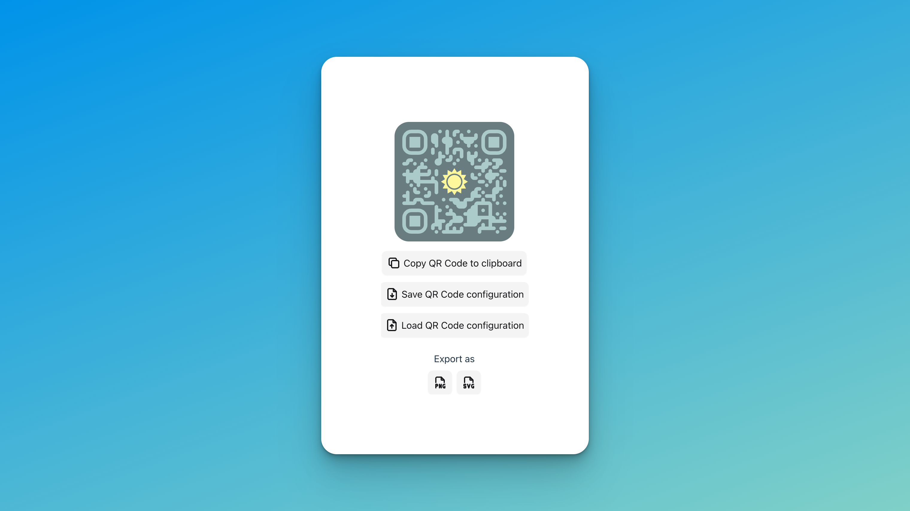

# styled-qr-code-generator

A customizable QR code generator that allows you to create beautiful and unique QR codes with various styles and colors.

## Features

V0
- Generate QR codes with custom colors and styles
- Support for various output formats, including SVG and PNG
- Copy to clipboard
- UI respects user's light/dark mode preferences
- Randomize style button
- Available in 29 languages thanks to [deepl-translate-github-action](https://github.com/lyqht/deepl-translate-github-action)
- Save & Load QR Code config

V0.1
- Upload custom image for logo

V0.2
- Presets: Pre-crafted QR code styles are available as immediate usage/ reference