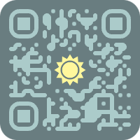
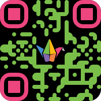
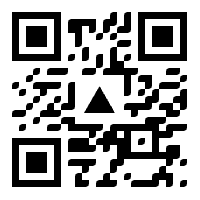
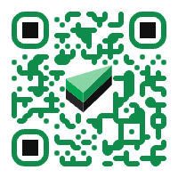

# styled-qr-code-generator

A customizable QR code generator to create beautiful and unique QR codes.

    
    
    
    
    
    
    

## Features

- Generate QR codes with custom colors and styles
- Support for various output formats, including SVG and PNG
- Copy to clipboard
- UI respects user's light/dark mode preferences
- Randomize style button
- Available in 29 languages thanks to [deepl-translate-github-action](https://github.com/lyqht/deepl-translate-github-action)
- Save & Load QR Code config
- Upload custom image for logo
- Presets: Pre-crafted QR code styles are available as immediate usage/ reference

### Demo of Randomize Style & Presets

