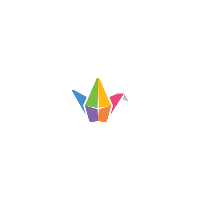
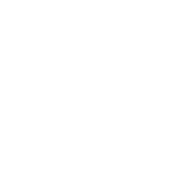

# Mini QR

An app to create beautiful QR codes and scan various QR code types.

    
    
    
    
    
    

## Features

> [Review of 'MiniQR' that makes it easy to create good-looking QR codes](https://gigazine.net/gsc_news/en/20241104-qr-code-generator-miniqr/) - Gigazine, an Osaka based tech news website, one of the top 25 news sites by TIME.com

- ✅ Accessible: minimally WCAG A compliant
- 🎨 Customizable colors and styles
- 🖼️ Export to PNG, JPG & SVG\*
- 📋 Copy to clipboard
- 🌓 Light/dark/system-preference mode toggle
- 🎲 Randomize style button
- 🌐 Available in 30+ languages
- 💾 Save & Load QR Code config
- 🖼️ Upload custom image for logo
- 🎭 Presets: Pre-crafted QR code styles
- 🖌️ Frame customization: Add text labels and style the frame around your QR code
- 🛡️ Error correction level: affects the size of the QR code and logo within. Use lower correction levels for bigger pieces of data to ensure that it can be read.
- 📱 QR Code Scanner: Scan QR codes using your camera or by uploading images, with intelligent detection for URLs, emails, phone numbers, WiFi credentials, and more
- 📦 Batch data export: Import a CSV file with multiple data strings and export QR codes for them all at once.
- 📲 PWA Support: Install MiniQR as a desktop or mobile app
- 📝 Data templates: Support for various data types including text, URLs, emails, phone numbers, SMS, WiFi credentials, vCards, locations, and calendar events

\*SVG export has limited support and may not display correctly in all software. For more information, please refer to [CONTRIBUTING.md](CONTRIBUTING.md).

## Demo

Try it out [here](https://mini-qr-code-generator.vercel.app/) ✨

Frame text included in batch export (added in v0.17.0)

https://github.com/user-attachments/assets/c6db8fd5-ec36-43be-b6e3-a42e1b7dc3cb

Data templates (added in v0.16.0)

https://github.com/user-attachments/assets/863f9330-2645-4d23-88aa-04f5f5beaa67

Basic frame settings (added in v0.15.0)

https://github.com/user-attachments/assets/e160d60d-3c7f-4bbb-908c-efd11fec20e8

Scanning QR code (added in v0.13.0)

https://github.com/user-attachments/assets/5ad58b35-0a16-43a4-839a-e2197bfc273a

Batch data export (added in v0.9.0)

https://github.com/user-attachments/assets/fef17e6a-c226-4136-9501-8d3e951671e0

MVP - presets, languages, dark/light mode (v0.3.0)

https://github.com/lyqht/mini-qr/assets/35736525/991b2d7e-f168-4354-9091-1678d2c1bddb

## Self-hosting

For full self-hosting instructions including Docker setup, environment variables, custom presets, and deployment scenarios, see [SELF_HOSTING.md](SELF_HOSTING.md).

## Contributing

 

Translations & bug fixes are welcome!
For all other matters, before opening an issue or contacting the project maintainer, please read up on to [CONTRIBUTING.md](CONTRIBUTING.md).

---

Thank you for everyone here for taking their time out to improve MiniQR 🧡

<!-- ALL-CONTRIBUTORS-LIST:START - Do not remove or modify this section -->
<!-- prettier-ignore-start -->
<!-- markdownlint-disable -->
<table>
  <tbody>
    <tr>
      <td align="center" valign="top" width="16.66%"><a href="https://github.com/tenekev"> <b>tenekev</b></a> <a href="https://github.com/lyqht/mini-qr/commits?author=tenekev" title="Code">💻</a> <a href="https://github.com/lyqht/mini-qr/commits?author=tenekev" title="Documentation">📖</a></td>
      <td align="center" valign="top" width="16.66%"><a href="https://zainf.dev/"> <b>Zain Fathoni</b></a> <a href="#design-zainfathoni" title="Design">🎨</a></td>
      <td align="center" valign="top" width="16.66%"><a href="https://github.com/katullo11"> <b>Francesco</b></a> <a href="#translation-katullo11" title="Translation">🌍</a></td>
      <td align="center" valign="top" width="16.66%"><a href="https://github.com/ssrahul96"> <b>Rahul Somasundaram</b></a> <a href="https://github.com/lyqht/mini-qr/commits?author=ssrahul96" title="Code">💻</a></td>
      <td align="center" valign="top" width="16.66%"><a href="https://github.com/tecking"> <b>tecking</b></a> <a href="#translation-tecking" title="Translation">🌍</a></td>
      <td align="center" valign="top" width="16.66%"><a href="https://github.com/davidxhk"> <b>David Xie</b></a> <a href="https://github.com/lyqht/mini-qr/commits?author=davidxhk" title="Code">💻</a></td>
    </tr>
    <tr>
      <td align="center" valign="top" width="16.66%"><a href="https://github.com/pcbimon"> <b>Patipat Chewprecha</b></a> <a href="#translation-pcbimon" title="Translation">🌍</a> <a href="https://github.com/lyqht/mini-qr/commits?author=pcbimon" title="Code">💻</a> <a href="https://github.com/lyqht/mini-qr/commits?author=pcbimon" title="Documentation">📖</a></td>
      <td align="center" valign="top" width="16.66%"><a href="https://github.com/itsAnuga"> <b>Johan Ekström</b></a> <a href="https://github.com/lyqht/mini-qr/commits?author=itsAnuga" title="Code">💻</a></td>
      <td align="center" valign="top" width="16.66%"><a href="https://furycode.org/"> <b>Klemens Graf</b></a> <a href="https://github.com/lyqht/mini-qr/commits?author=klemensgraf" title="Code">💻</a></td>
      <td align="center" valign="top" width="16.66%"><a href="https://github.com/unililium"> <b>林都</b></a> <a href="https://github.com/lyqht/mini-qr/commits?author=unililium" title="Code">💻</a> <a href="#translation-unililium" title="Translation">🌍</a></td>
      <td align="center" valign="top" width="16.66%"><a href="https://github.com/seals187"> <b>seals187</b></a> <a href="https://github.com/lyqht/mini-qr/pulls?q=is%3Apr+reviewed-by%3Aseals187" title="Reviewed Pull Requests">👀</a></td>
      <td align="center" valign="top" width="16.66%"><a href="https://github.com/olvier"> <b>olvier</b></a> <a href="https://github.com/lyqht/mini-qr/pulls?q=is%3Apr+reviewed-by%3Aolvier" title="Reviewed Pull Requests">👀</a></td>
    </tr>
    <tr>
      <td align="center" valign="top" width="16.66%"><a href="https://github.com/matthewberryman"> <b>Matthew Berryman</b></a> <a href="https://github.com/lyqht/mini-qr/commits?author=matthewberryman" title="Code">💻</a></td>
      <td align="center" valign="top" width="16.66%"><a href="https://github.com/Mr-Robot-ops"> <b>Mr-robot-ops</b></a> <a href="#translation-Mr-Robot-ops" title="Translation">🌍</a> <a href="https://github.com/lyqht/mini-qr/commits?author=Mr-Robot-ops" title="Code">💻</a></td>
      <td align="center" valign="top" width="16.66%"><a href="https://github.com/danktankk"> <b>danktankk</b></a> <a href="https://github.com/lyqht/mini-qr/commits?author=danktankk" title="Code">💻</a></td>
      <td align="center" valign="top" width="16.66%"><a href="https://github.com/clausjs"> <b>Joseph Claus</b></a> <a href="https://github.com/lyqht/mini-qr/commits?author=clausjs" title="Documentation">📖</a></td>
      <td align="center" valign="top" width="16.66%"><a href="https://github.com/kennydude"> <b>Joe Simpson</b></a> <a href="https://github.com/lyqht/mini-qr/commits?author=kennydude" title="Documentation">📖</a></td>
      <td align="center" valign="top" width="16.66%"><a href="https://github.com/toha-tiger"> <b>toha-tiger</b></a> <a href="https://github.com/lyqht/mini-qr/commits?author=toha-tiger" title="Code">💻</a> <a href="#design-toha-tiger" title="Design">🎨</a></td>
    </tr>
    <tr>
      <td align="center" valign="top" width="16.66%"><a href="https://github.com/Kolophonium0"> <b>Yannik Herbst</b></a> <a href="#question-Kolophonium0" title="Answering Questions">💬</a></td>
      <td align="center" valign="top" width="16.66%"><a href="http://solovjov.net/"> <b>Mikhail Solovev</b></a> <a href="#translation-r3bers" title="Translation">🌍</a></td>
    </tr>
  </tbody>
  <tfoot>
    <tr>
      <td align="center" size="13px" colspan="6">
        
          <a href="https://all-contributors.js.org/docs/en/bot/usage">Add your contributions</a>
        </img>
      </td>
    </tr>
  </tfoot>
</table>

<!-- markdownlint-restore -->
<!-- prettier-ignore-end -->

<!-- ALL-CONTRIBUTORS-LIST:END -->
